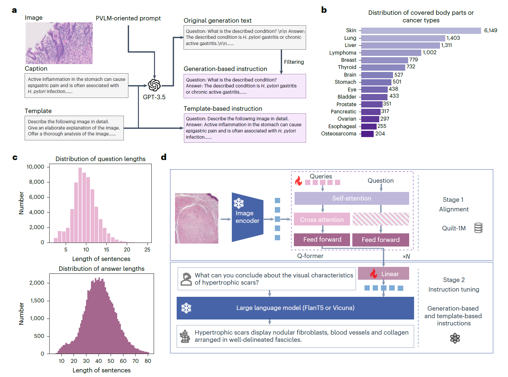

<div align="center">

  
  # CLOVER: Cost-effective Instruction Learning for Pathology Vision and Language Analysis
  
  [](https://doi.org/10.1038/s43588-025-00818-5) [](https://arxiv.org/abs/2407.17734) [](LICENSE) [](https://github.com/JLINEkai/CLOVER)
  

  
  <!-- *A cost-effective instruction learning framework for conversational pathology analysis* -->
</div>

---

## 📅 Latest News

**[2025/11]** 🔥 **CLOVER Based on Qwen2.5-VL Version!** We release a new version of CLOVER based on Qwen2.5-VL on **[Hugging Face](https://huggingface.co/jline/CLOVER-Qwen2.5-VL)**, offering enhanced multimodal capabilities and improved performance for pathology analysis.

**[2025/06]** ⭐ **Training Data and Model Based on BLIP-2 Released on Hugging Face!** Our instruction data and models are now available on [Hugging Face](https://huggingface.co/jline/CLOVER_instructions) for easy access and deployment. Details can be found in the [CLOVER-Ori](CLOVER-Ori).

**[2025/06]** 🎉 **Paper Published in Nature Computational Science!** Our paper "Cost-effective Instruction Learning for Pathology Vision and Language Analysis" has been officially published in [Nature Computational Science](https://doi.org/10.1038/s43588-025-00818-5).

**[2024/07]** 📝 **arXiv Preprint Available!** Our paper "Cost-effective Instruction Learning for Pathology Vision and Language Analysis" is now available on [arXiv](https://arxiv.org/abs/2407.17734).

---

## 📖 Overview

CLOVER is a cost-effective instruction learning framework designed for conversational pathology analysis. It addresses the challenges of deploying vision-language models in clinical settings by providing an efficient training approach that requires minimal computational resources while maintaining high performance.

<!-- ### 🎯 Key Features

- **🔄 Two-Stage Training**: Vision-language alignment + instruction fine-tuning
- **💰 Cost-Effective**: Uses GPT-3.5 for instruction generation only costs $8
- **⚡ Lightweight**: Only trains a small module while freezing LLM parameters
- **🏥 Domain-Specific**: Optimized for pathology analysis with specialized instructions
- **📊 High Performance**: Outperforms baselines with 37x more training parameters -->

<!-- ### 🚀 Quick Start

```bash
# Clone the repository
git clone https://github.com/JLINEkai/CLOVER.git
cd CLOVER

# Install dependencies
conda create -n clover python=3.9
conda activate clover
pip install -r requirements.txt
``` -->

---

## 🧠 Architecture

<div align="center">
  

  **A schematic illustration of CLOVER.** **a** The workflow for instruction generation.  **b** The distribution of covered body parts or cancer types. **c** The distribution of question and answer sentence lengths. **d** The workflow of CLOVER.
  

</div>


<!-- 1. **Stage 1 - Alignment**: Uses Quilt-1M dataset for vision-language representation learning
2. **Stage 2 - Instruction Fine-tuning**: Domain-specific instruction data for pathology analysis -->

---

## 🚀 Quick Start


### Step-by-Step Installation

  ```bash
conda create -n clover python=3.10
conda activate clover

pip install torch==2.4.0 torchvision==0.19.0 --extra-index-url https://download.pytorch.org/whl/cu118

pip install transformers==4.52.4 accelerate qwen-vl-utils
  ```

### Run
```Python
from transformers import Qwen2_5_VLForConditionalGeneration, AutoTokenizer, AutoProcessor
from qwen_vl_utils import process_vision_info
import torch
# default: Load the model and processer on the available device(s)
model = Qwen2_5_VLForConditionalGeneration.from_pretrained(
    "jline/CLOVER-Qwen2.5-VL", torch_dtype=torch.bfloat16, device_map="auto"
)
processor = AutoProcessor.from_pretrained("jline/CLOVER-Qwen2.5-VL")

messages = [
    {
        "role": "user",
        "content": [
            {
                "type": "image",
                "image": "./image_path.png",
            },
            {"type": "text", "text": "Describe this image."},
        ],
    }
]

# Preparation for inference
text = processor.apply_chat_template(
    messages, tokenize=False, add_generation_prompt=True
)
image_inputs, video_inputs = process_vision_info(messages)
inputs = processor(
    text=[text],
    images=image_inputs,
    videos=video_inputs,
    padding=True,
    return_tensors="pt",
)
inputs = inputs.to("cuda")

# Inference: Generation of the output
generated_ids = model.generate(**inputs, max_new_tokens=128)
generated_ids_trimmed = [
    out_ids[len(in_ids) :] for in_ids, out_ids in zip(inputs.input_ids, generated_ids)
]
output_text = processor.batch_decode(
    generated_ids_trimmed, skip_special_tokens=True, clean_up_tokenization_spaces=False
)
print(output_text)
```

## 🏋️ Training
For CLOVER-Qwen2.5-VL training, we follow a curriculum similar to [LLaMA-Factory](https://github.com/hiyouga/LLaMA-Factory). Note, the first version of CLOVER-BLIP2's training can be found in the [CLOVER-Ori](CLOVER-Ori) folder.

## 📄 License

This project is licensed under the MIT License - see the [LICENSE](LICENSE) file for details.

---


## 🙏 Acknowledgments

- Based on [Qwen2.5-VL](https://huggingface.co/Qwen) and [BLIP-2](https://github.com/salesforce/LAVIS/tree/main) framework

- Inspired by recent advances in vision-language models

---


## 📚 Citation

If you find this work useful, please cite our paper:

```bibtex
@article{chen2025cost,
  title={Cost-effective instruction learning for pathology vision and language analysis},
  author={Chen, K. and Liu, M. and Yan, F. and others},
  journal={Nature Computational Science},
  year={2025},
  doi={10.1038/s43588-025-00818-5}
}
```

<!-- **Paper**: [Nature Computational Science (2025)](https://doi.org/10.1038/s43588-025-00818-5) | [arXiv (2024)](https://arxiv.org/abs/2407.17734) -->

---

<div align="center">
  <sub>Made with ❤️ for the pathology research community</sub>
</div>


