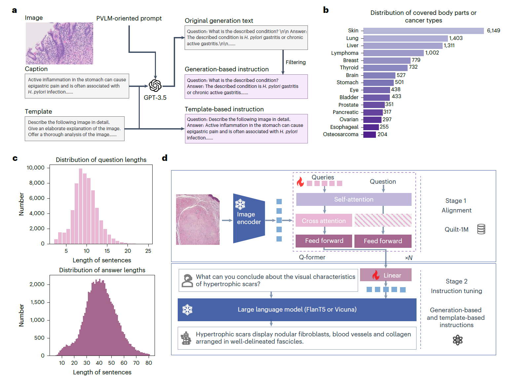
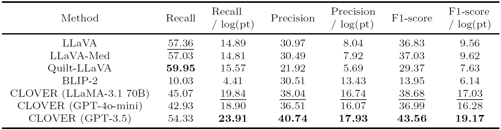

<div align="center">

  
  # CLOVER: Cost-effective Instruction Learning for Pathology Vision and Language Analysis
  
  [](https://doi.org/10.1038/s43588-025-00818-5) [](https://arxiv.org/abs/2407.17734) [](LICENSE) [](https://github.com/JLINEkai/CLOVER)
  

  
  <!-- *A cost-effective instruction learning framework for conversational pathology analysis* -->
</div>

---

## 📅 Latest News

**[2025/06]** 🎉 **Paper Published in Nature Computational Science!** Our paper "Cost-effective Instruction Learning for Pathology Vision and Language Analysis" has been officially published in [Nature Computational Science](https://doi.org/10.1038/s43588-025-00818-5).

**[2024/07]** 📝 **arXiv Preprint Available!** Our paper "Cost-effective Instruction Learning for Pathology Vision and Language Analysis" is now available on [arXiv](https://arxiv.org/abs/2407.17734).

---

## 📖 Overview

CLOVER is a cost-effective instruction learning framework designed for conversational pathology analysis. It addresses the challenges of deploying vision-language models in clinical settings by providing an efficient training approach that requires minimal computational resources while maintaining high performance.

### 🎯 Key Features

- **🔄 Two-Stage Training**: Vision-language alignment + instruction fine-tuning
- **💰 Cost-Effective**: Uses GPT-3.5 for instruction generation only costs $8
- **⚡ Lightweight**: Only trains a small module while freezing LLM parameters
- **🏥 Domain-Specific**: Optimized for pathology analysis with specialized instructions
- **📊 High Performance**: Outperforms baselines with 37x more training parameters

<!-- ### 🚀 Quick Start

```bash
# Clone the repository
git clone https://github.com/JLINEkai/CLOVER.git
cd CLOVER

# Install dependencies
conda create -n clover python=3.9
conda activate clover
pip install -r requirements.txt
``` -->

---

## 🧠 Architecture

<div align="center">
  

  **A schematic illustration of CLOVER.** **a** The workflow for instruction generation.  **b** The distribution of covered body parts or cancer types. **c** The distribution of question and answer sentence lengths. **d** The workflow of CLOVER.
  

</div>

### Training Stages

<!-- 1. **Stage 1 - Alignment**: Uses Quilt-1M dataset for vision-language representation learning
2. **Stage 2 - Instruction Fine-tuning**: Domain-specific instruction data for pathology analysis -->

---

## ⚙️ Installation

### Prerequisites

- Python 3.8+
- CUDA-compatible GPU 

### Step-by-Step Installation

1. **Create Conda Environment**
   ```bash
   conda create -n clover python=3.9
   conda activate clover
   ```

2. **Clone Repository**
   ```bash
   git clone https://github.com/JLINEkai/CLOVER.git
   cd CLOVER
   ```

3. **Install Dependencies**
   ```bash
   pip install -r requirements.txt
   ```

---

## 🔧 Usage

### Training

#### Stage 1: Vision-Language Alignment
```bash
python train_blip2qformer.py
```

#### Stage 2: Instruction Fine-tuning
```bash
python -m torch.distributed.run --nproc_per_node=1 train.py
```

**Note**: You can choose the large language model (LLM) in `lavis/projects/blip2/train/pretrain_stage2.yaml`. We provide support for FlanT5XL and Vicuna 7B.

### Inference

```bash
python -m torch.distributed.run --nproc_per_node=1 evaluate.py --cfg-path lavis/projects/blip2/eval/vqav2_zeroshot_flant5xl_eval.yaml
```

---

## 📊 Results & Performance

### Benchmark Results

CLOVER demonstrates superior performance on pathology vision-language tasks.


### Quantitative Comparison
<div align="center">
  
  
  *Comparison with SOTA methods on PathVQA dataset.*
</div>

<div align="center">
  
  
  *Comparison with prior SOTA methods on QUILT-VQA dataset.*
</div>


### Qualitative Examples


<div align="center">
  
  
  *Qualitative comparisons of visual question answering.*
</div>

---

## 📁 Data

### Required Datasets

1. **Quilt-1M Dataset** (Stage 1)
   - Download from [Google Drive](https://docs.google.com/forms/d/e/1FAIpQLSdSe06DIbPn71jA2rCxe_5tUPfyHhSH1Z7ZTJBxWM26cnpZFg/viewform)
   - Alternative: [Zenodo](https://zenodo.org/records/8239942)

2. **CLOVER Instructions** (Stage 2)
   - Will be released soon
   - You can generate your own using our prompts in `generate_instructions.py`


---

## 📄 License

This project is licensed under the MIT License - see the [LICENSE](LICENSE) file for details.

---


## 🙏 Acknowledgments

- Based on [BLIP-2](https://github.com/salesforce/LAVIS/tree/main) framework

- Inspired by recent advances in vision-language models

---


## 📚 Citation

If you find this work useful, please cite our paper:

```bibtex
@article{chen2025cost,
  title={Cost-effective instruction learning for pathology vision and language analysis},
  author={Chen, K. and Liu, M. and Yan, F. and others},
  journal={Nature Computational Science},
  year={2025},
  doi={10.1038/s43588-025-00818-5}
}
```

<!-- **Paper**: [Nature Computational Science (2025)](https://doi.org/10.1038/s43588-025-00818-5) | [arXiv (2024)](https://arxiv.org/abs/2407.17734) -->

---

<div align="center">
  <sub>Made with ❤️ for the pathology research community</sub>
</div>


