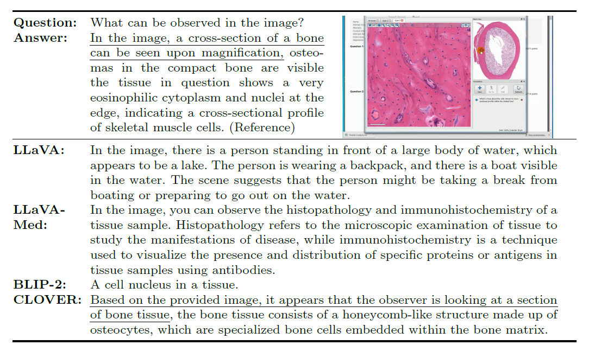

# Cost-effective Instruction Learning for Pathology Vision and Language Analysis (CLOVER)

The advent of vision-language models fosters the interactive conversations between AI-enabled models and humans. Yet applying these models into clinics must deal with daunting challenges around large-scale training data, financial, and computational resources. Here we propose a cost-effective instruction learning framework for conversational pathology named as CLOVER. CLOVER only trains a lightweight module and uses instruction tuning while freezing the parameters of the large language model. Instead of using costly GPT-4, we propose well-designed prompts on GPT-3.5 for building generation-based instructions, emphasizing the utility of pathological knowledge derived from the Internet source. To augment the use of instructions, we construct a high-quality set of template-based instructions in the context of digital pathology. From two benchmark datasets, our findings reveal the strength of hybrid-form instructions in the visual question-answer in pathology. Extensive results show the cost-effectiveness of CLOVER in answering both open-ended and closed-ended questions, where CLOVER outperforms strong baselines that possess 37 times more training parameters and use instruction data generated from GPT-4. Through the instruction tuning, CLOVER exhibits robustness of few-shot learning in the external clinical dataset. These findings demonstrate that cost-effective modeling of CLOVER could accelerate the adoption of rapid conversational applications in the landscape of digital pathology.


## Release
- Checkpoints and instruction dataset will be released soon. 
 


## Workflow of CLOVER

<p align="center">
     <br>
 
  *CLOVER employs the training framework of BLIP-2 to achieve a fast domain tuning with lightweight parameters. The entire training process of CLOVER includes two major stages: (i) alignment of vision and language and (ii) supervised fine-tuning with instructions. The alignment compels the model to acquire valuable representations between vision and language. Instruction fine-tuning is vital here for activating LLMs to excel in visual language question answering. Stage 1 requires inputs of image-text pairs, where we use the large-scale Quilt-1M dataset. Stage 2 demands domain-specific instruction data. As we have seen a significant lack of the required instruction data in the literature, we propose a low-cost solution of instruction data generation carefully designed for analyzing pathological data.*
</p>


## Contents
- [Cost-effective Instruction Learning for Pathology Vision and Language Analysis (CLOVER)](#cost-effective-instruction-learning-for-pathology-vision-and-language-analysis-clover)
  - [Release](#release)
  - [Workflow of CLOVER](#workflow-of-clover)
  - [Contents](#contents)
    - [Data Download](#data-download)
    - [Installation](#installation)
    - [Training](#training)
    - [Inference](#inference)
  - [Case Study](#case-study)
  - [Related Projects](#related-projects)


### Data Download
- Stage 1: Quilt-1M dataset can be downloaded from [Google](https://docs.google.com/forms/d/e/1FAIpQLSdSe06DIbPn71jA2rCxe_5tUPfyHhSH1Z7ZTJBxWM26cnpZFg/viewform) or [Zenodo](https://zenodo.org/records/8239942).
- Stage 2: CLOVER Instructions will be released. Of course, you can also use our prompt to generate the data from [PY FILE](./generate_instructions.py) if you want.


### Installation

1. Creating conda environment
```bash
conda create -n clover python=3.9
conda activate clover
```

2. Building from source
```bash
git clone https://github.com/JLINEkai/CLOVER.git
cd CLOVER
pip install -r requirements.txt
```


### Training
- Stage 1 (Alignment): 
```bash
python train_blip2qformer.py
```
- Stage 2 (Instruction finetuning): 
  
You can choose large language model (LLM) in [FILE](.\lavis\projects\blip2\train\pretrain_stage2.yaml). We provide FlanT5XL and Vicuna 7B.
```bash
python -m torch.distributed.run --nproc_per_node=1 train.py 
````

### Inference

```bash
python -m torch.distributed.run --nproc_per_node=1 evaluate.py --cfg-path lavis/projects/blip2/eval/vqav2_zeroshot_flant5xl_eval.yaml
````


## Case Study

<p align="center">
     <br>
 
  *Qualitative comparisons of visual question answering on QUILT-VQA. (Image source: QUILT-VQA)*
</p>

<p align="center">
     <br>
 
  *Qualitative comparisons of visual question answering on LLaVA-Med-17K. (Image source: [link](https://www.ncbi.nlm.nih.gov/pubmed/26147524))*
</p>

If you have any questions, please send an email to chenkaitao@pjlab.org.cn.

## Related Projects
- Our model is based on BLIP-2 [BLIP-2: Bootstrapping Language-Image Pre-training with Frozen Image Encoders and Large Language Models](https://github.com/salesforce/LAVIS/tree/main)


